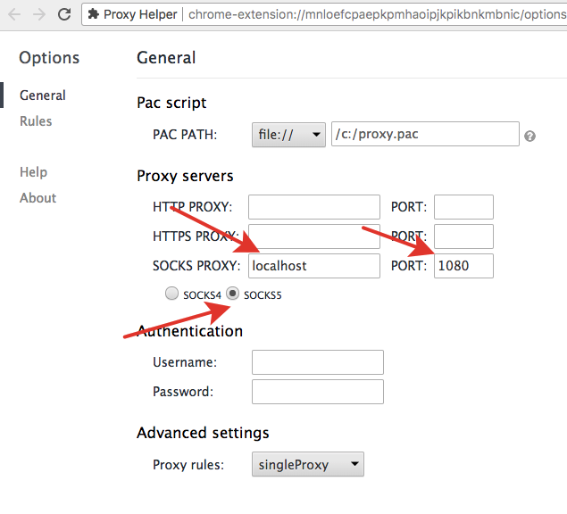
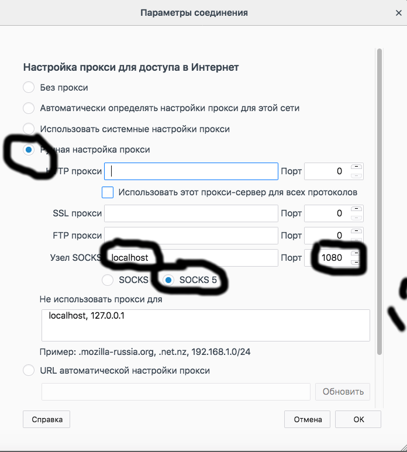
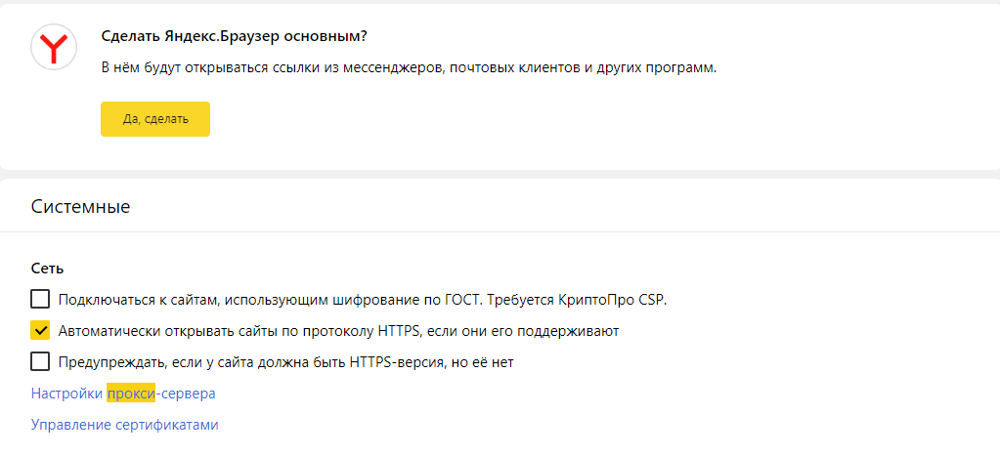
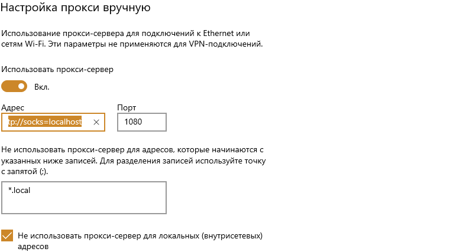
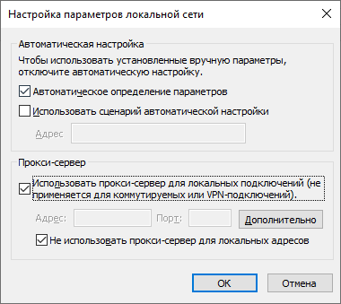
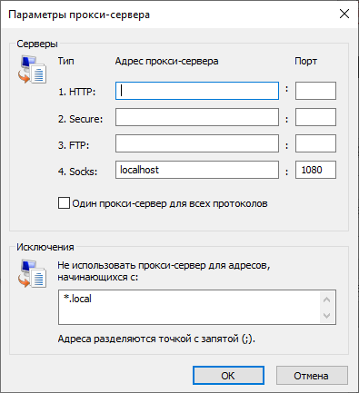
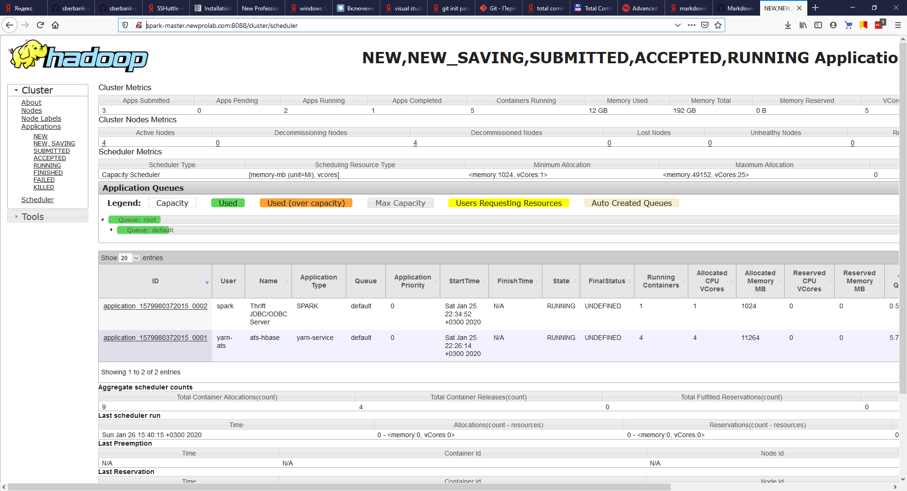

# Подключение к YARN UI

## Введение

Попасть в [YARN UI](http://spark-master-1.newprolab.com:8088/cluster/scheduler) можно на порту 8088. Однако, держать этот порт открытым для всех извне – небезопасно, поскольку в течение нескольких часов майнеры запустят свои джобы на всем кластере и загрузят его под завязку. Для безопасного авторизованного доступа мы используем прокси.

Прокси работает с браузерами только через туннель. Это, в общем-то, фундаментальное ограничение, так как через туннель происходит авторизация, а браузеры напрямую не авторизуют вход на прокси сервер.

Итак, как это выглядит в целом:

1. Сначала вы создаете ssh-туннель на машину, на которой запущен прокси сервер (кластер newprolab).
2. Затем вы конфигурируете прокси-соединение в вашем браузере, причем в качестве сервера выступает localhost – это "начало" туннеля, который вы создали через ssh.

Таким образом, каждый раз, когда вы захотите воспользоваться прокси-соединением, вам придется создать туннель. Это не очень удобно, так как, например, если ваш лаптоп заснет, то туннель придется поднимать заново. Поэтому мы рекомендуем использовать отдельный браузер с настройками прокси для доступа к кластеру, а в вашем основном браузере использовать "обычный" интернет от своего провайдера.

## Получение приватного ключа для авторизации

В личном кабинете во вкладке [Персональная информация](https://lk.newprolab.com/access) вы найдете свой приватный ключ. Скачайте его себе на компьютер, используя кнопку `Загрузить`.

💡 Примечание: рекомендуется именно скачать ключ, а не копировать его, т.к. это поможет вам избежать потерю/добавление лишних символов. 

### Настройка прав доступа к ключу с MacOS/Linux

Зайдите в консоль (Terminal).

Считаем, что ключ в вашей текущей директории. Настраиваем права:

```bash
chmod 0600 newprolab.pem
```

С помощью этой команды ключ становится доступным только текущему пользователю, в противном случае ssh будет считать его "слишком открытым" и "небезопасным".


### Настройка прав доступа к ключу с Windows

Сохраните приватный ключ для удобства в C:/Users/User. Если сохранить его на другой диск, команда ниже может начать ругаться, что он доступен другим пользователям.


## Как настроить туннель

### Для пользователей Mac, Linux

Для упрощения создания туннеля следует добавить следующую секцию в ваш .ssh/config

```
Host nplp
HostName spark-node-1.newprolab.com
Port 22
User name.surname
DynamicForward 1080
IdentityFile ~/.ssh/newprolab.pem
```

и в конец вашего ssh конфига

```
Host *
ServerAliveInterval 30
LogLevel INFO
UserKnownHostsFile ~/.ssh/known_hosts
```

Тогда вы сможете запустить тунель как: `ssh -N nplp`

Или если не добавлять ничего в конфиг, то можно подключиться одной командой:

`$ ssh name.surname@spark-node-1.newprolab.com -D localhost:1080 -N -i <приватный ключ>`

Если все нормально, то в первый раз вы увидите такое:
```bash
The authenticity of host 'spark-node-1.newprolab.com (89.208.84.16)' can't be established.
ECDSA key fingerprint is SHA256:gH/t91+1LyhAugjiNJTdCrlI3gdFxPe7Nu2YGJWBu30.
Are you sure you want to continue connecting (yes/no)? 

```

После этого ничего не происходит, но теперь есть туннель. Переходите в секцию [Настройка браузера](#настройка-браузера).

### Для пользователей Windows

1. Если у вас Windows 10, то у вас есть терминал по умолчанию, в котором можно использовать те же самые команды, что и для пользователей MacOS/Linux.
2. Если у вас более старая операционная система, то скачайте и установите [GitBash](https://gitforwindows.org/). Это вам опять же позволит работать в терминале с теми же командами.

## Настройка браузера

Так как неразумно использовать прокси для всего вашего трафика все время (это замедляет скорость соединенения), то предлагаем взять неиспользуемый браузер, и выделить его для работы с кластером во время программы. Например, я пользуюсь Firefox в качестве основного браузера и сконфигурирую Chrome для работы с прокси.

### MacOS/Linux на примере Chrome

Хром на Линукс и MAC OS почему-то не поддерживает настройку прокси через Settings, поэтому есть два других пути, описанные ниже. 

#### В командной строке

Выполняем команду `chromium-browser --proxy-server=socks5://localhost:1080`

#### С помощью расширения

Устанавливаем [https://chrome.google.com/webstore/detail/proxy-helper/mnloefcpaepkpmhaoipjkpikbnkmbnic](https://chrome.google.com/webstore/detail/proxy-helper/mnloefcpaepkpmhaoipjkpikbnkmbnic)

и настраиваем в соответствие с картинкой.




### Windows 
#### Mozliila Firefox

Preferences->General->Network Proxy->Settings... (Настройки - Параметры сети - Настроить)



#### Google Chome 

1. Установить расширение [Proxy helper](https://chrome.google.com/webstore/detail/proxy-helper/mnloefcpaepkpmhaoipjkpikbnkmbnic)

2. Задать настройки в соответствии с картинкой


3. Включить режим Proxy в меню расширения


#### Yandex.Browser
Не имеет собственных настроек прокси - использует системные.



В системных настройках вписываем в строку "Адрес" http://socks=localhost



#### Microsoft Internet Explorer
Также использует системные настройки

1. Открываем меню "Сервис" - "Свойства браузера"  
2. Переходим на вкладку "Подключения"  

  
3. Открываем "Настройка сети", ставим "Использовать прокси-сервер". Нажимаем "Дополнительно"  
  
  
4. Устанавливем адрес для протокола Socks5  
  
  
5. Сохраняем все настройки  

💡 Примечание: на Windows вы не можете использовать Chrome, Yandex.Browser и Internet Explorer для разных целей - они либо вместе без прокси, либо вместе с прокси т.е используют систмные настройки прокси-сервера

## Проверка

Откройте [YARN UI](http://spark-master-1.newprolab.com:8088/cluster/scheduler)

Страница выглядит так:

